# LinkVault Mermaid Diagrams

## 1. Complete Data Flow: Upload to Storage

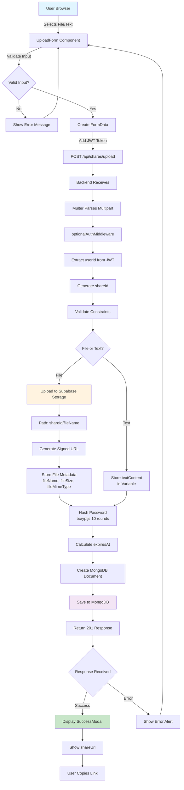

---

## 2. Data Flow: View & Download Share

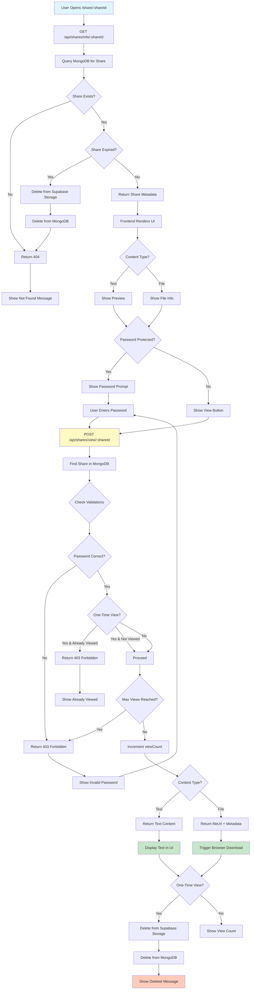

---

## 3. Authentication & Token Flow

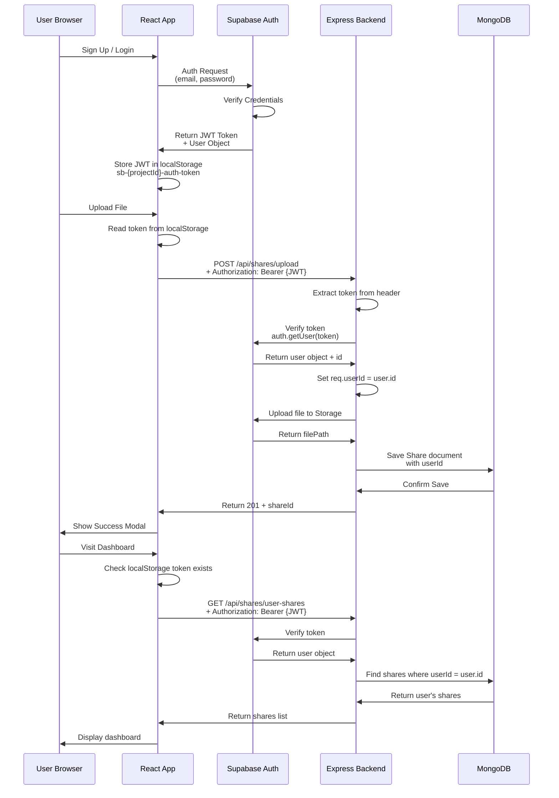

---

## 4. Cleanup Flow: Three Mechanisms

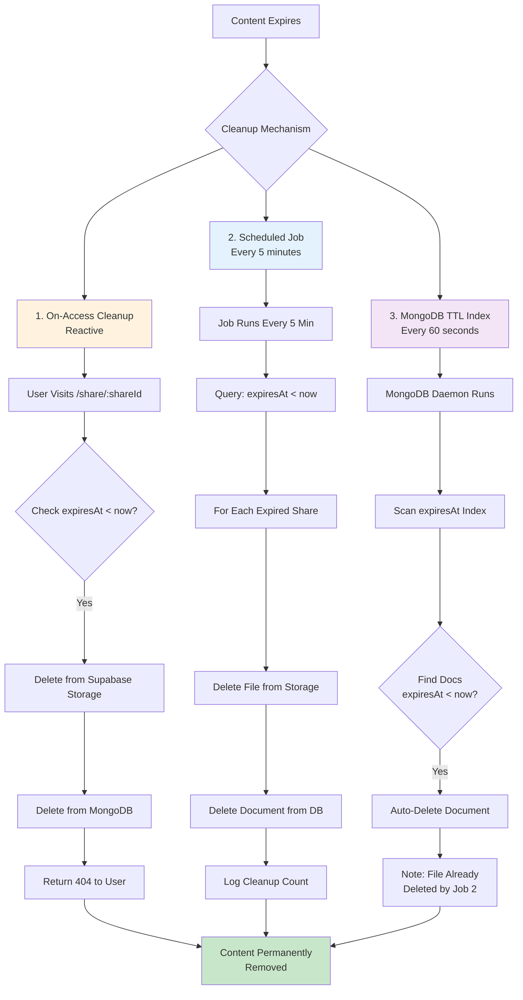

---

## 5. Database Schema: Share Collection

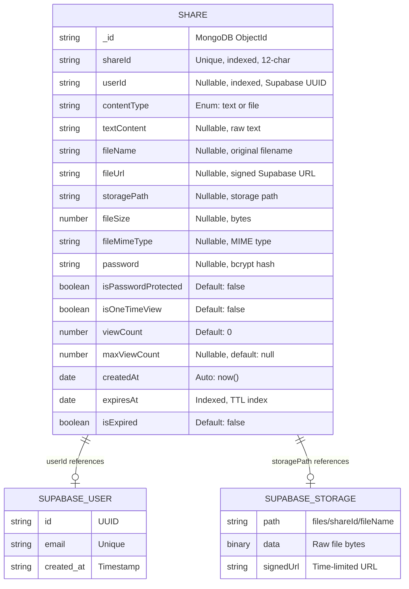

---

## 6. System Architecture Flow

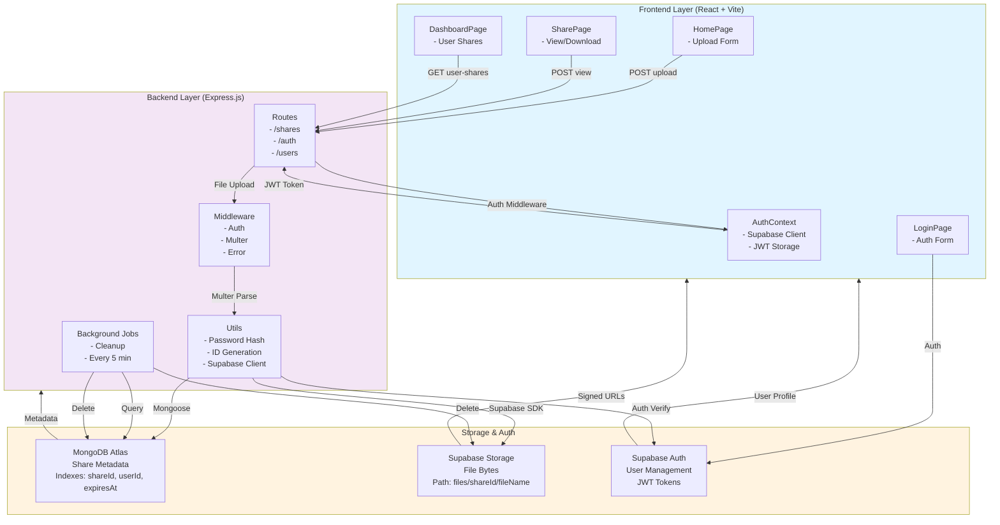

---

## 7. Upload Process: Detailed Sequence

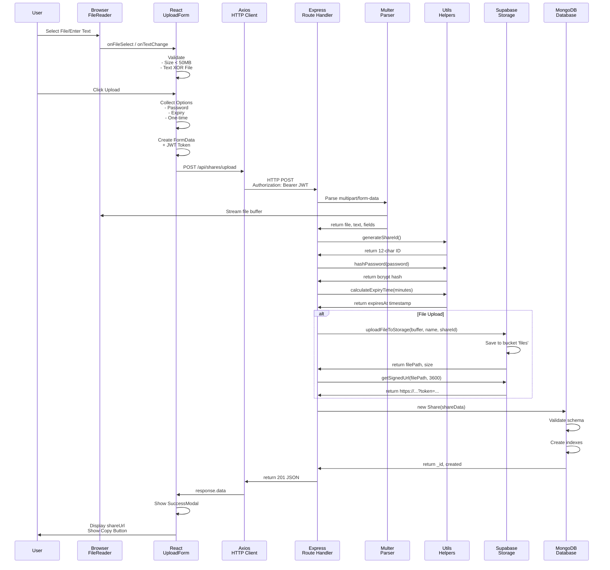

---

## 8. View/Access Flow: Sequence Diagram

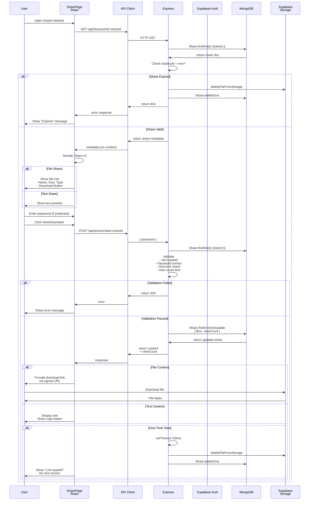

---

## 9. Database Relationships

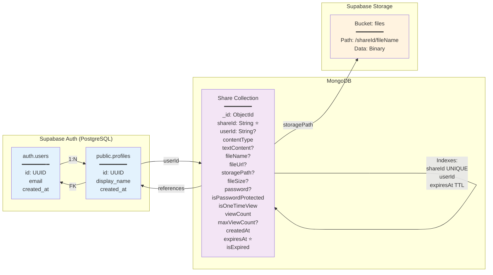

---

## 10. Error Handling Flow

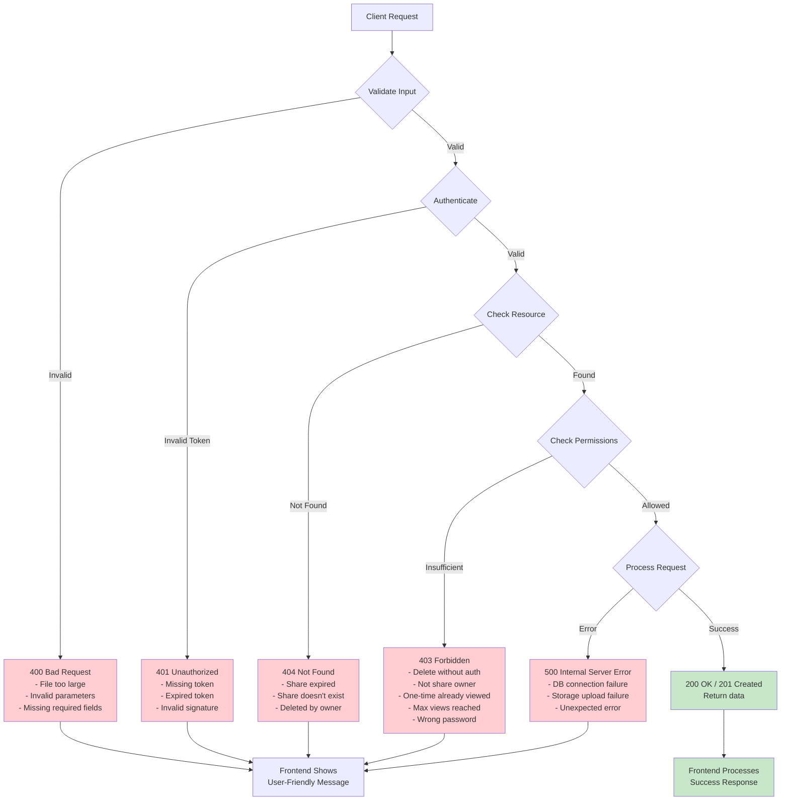

---

## 11. State Machine: Share Lifecycle

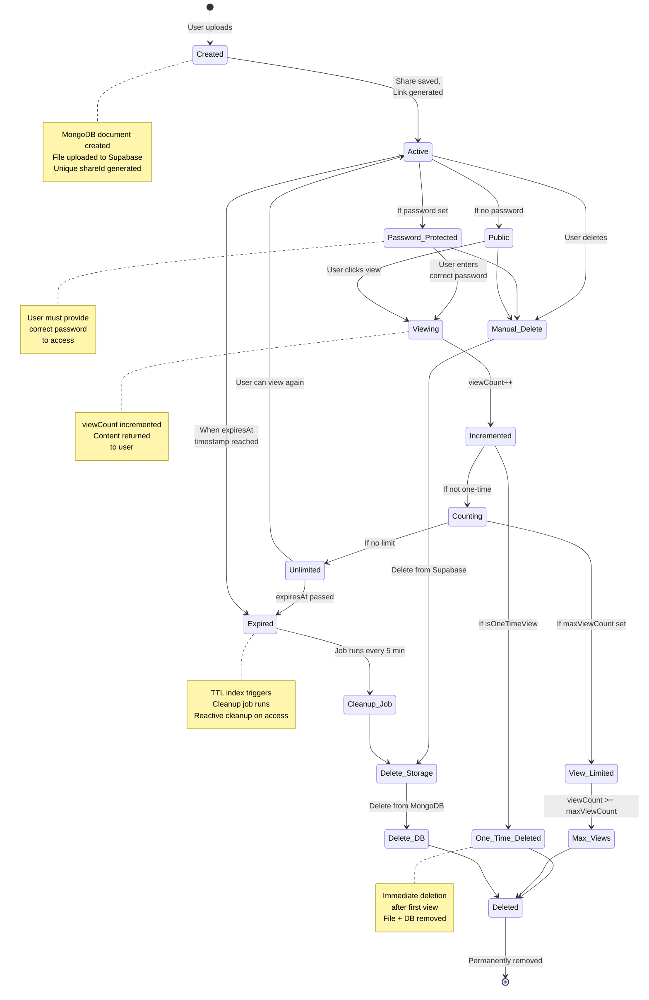

---

## 12. API Endpoints: Request/Response Flow

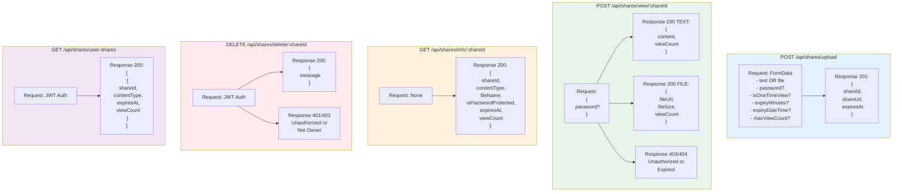

---

These Mermaid diagrams provide:

1. **Data Flow Upload** - Complete upload journey
2. **Data Flow View/Download** - Viewing and accessing shares
3. **Authentication** - Token and auth verification
4. **Cleanup Mechanisms** - Three parallel cleanup strategies
5. **Database Schema** - ER diagram of all data relationships
6. **System Architecture** - Component interactions
7. **Upload Sequence** - Detailed step-by-step process
8. **View/Access Sequence** - Complete access flow
9. **Database Relationships** - Entity relationships
10. **Error Handling** - Error scenarios and responses
11. **State Machine** - Share lifecycle from creation to deletion
12. **API Endpoints** - Request/response patterns

You can copy these directly into Mermaid Live Editor (https://mermaid.live) or include them in your documentation!
